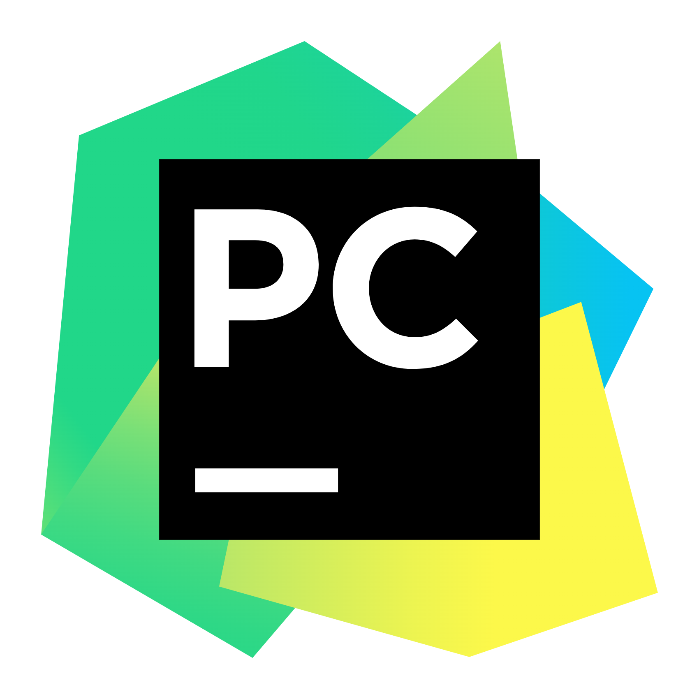

Hi My name is Stefan Yakshev
======================================================================================================================================

## About Me
I am passionate about the intersection of Python programming and computational design, embarking on a journey to explore the limitless possibilities they offer.

*   🌍  I'm based in Sofia, Bulgaria
*   ⚡  Tech Enthusiast: Beyond Python and computational design, I'm passionate about exploring emerging technologies, staying up-to-date with industry trends, and embracing the ever-evolving tech landscape.
*   📚  Bookworm: In my downtime, you'll often find me immersed in a good book. Feel free to share your favorite reads or recommend something you found captivating!
*   ☕  Coffee Lover: Coffee is my fuel for coding marathons. Share your favorite coffee blends or drop by for a virtual coffee chat!
*   ✉️  You can contact me at [stefan.yaksheff@gmail.com](mailto:stefan.yaksheff@gmail.com)

## 🚀 My Journey

- 🌱 I'm currently learning Python for computational design and enjoying every moment of the process.
- 💡 Exploring creative coding, algorithmic art, and generative design is my current focus.
- 🤝 I'm open to collaborations and eager to connect with like-minded individuals in the Python and design communities.
  
## 💻 Technologies & Tools   
                    

## 🌐 Connect with Me

 <a href="https://www.behance.com/stefanyaksheff" target="_blank" rel="noreferrer"> <picture> <source media="(prefers-color-scheme: dark)" srcset="undefined" /> <source media="(prefers-color-scheme: light)" srcset="https://raw.githubusercontent.com/danielcranney/readme-generator/main/public/icons/socials/behance.svg" />  </picture> </a> <a href="https://discord.com/users/stefan.yaksheff" target="_blank" rel="noreferrer"> <picture> <source media="(prefers-color-scheme: dark)" srcset="undefined" /> <source media="(prefers-color-scheme: light)" srcset="https://raw.githubusercontent.com/danielcranney/readme-generator/main/public/icons/socials/discord.svg" />  </picture> </a> <a href="https://www.github.com/stfn333" target="_blank" rel="noreferrer"> <picture> <source media="(prefers-color-scheme: dark)" srcset="https://raw.githubusercontent.com/danielcranney/readme-generator/main/public/icons/socials/github-dark.svg" /> <source media="(prefers-color-scheme: light)" srcset="https://raw.githubusercontent.com/danielcranney/readme-generator/main/public/icons/socials/github.svg" />  </picture> </a> <a href="https://www.linkedin.com/in/stefanyaksheff/" target="_blank" rel="noreferrer"> <picture> <source media="(prefers-color-scheme: dark)" srcset="https://raw.githubusercontent.com/danielcranney/readme-generator/main/public/icons/socials/linkedin-dark.svg" /> <source media="(prefers-color-scheme: light)" srcset="https://raw.githubusercontent.com/danielcranney/readme-generator/main/public/icons/socials/linkedin.svg" />  </picture> </a>

